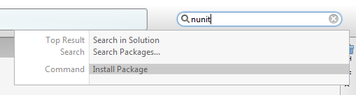
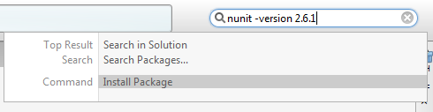

# Extends the NuGet Addin for MonoDevelop and Xamarin Studio

Adds some extra features to the NuGet addin that are not currently built-in.

These features are experimental, subject to change, removal, and should be considered alpha quality. 

Please use at your own risk.

# Requirements

 * MonoDevelop 5.0 or Xamarin Studio 5.0

# Features

## Install a NuGet package from the unified search

To install the latest version of a NuGet package

 * Make sure the project is selected in the **Solution** window.
 * Type in the package id into the unified search.
 * Select **Install Package**

The NuGet package will then be installed in the background.
 
To install a specific version of the package use can specify the -version option:

       nunit -version 2.6.1
       

 
The status bar will be update as the install progresses. Errors will be displayed in the **Package Console**.

The unified search is available at the top right of the main Xamarin Studio window.
